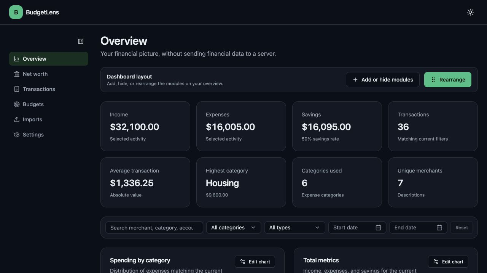

# BudgetLens

BudgetLens is a private, local-first dashboard for exploring transaction, net-worth, and
investment-history exports from
[Credit Karma Extractor](https://github.com/cbangera2/CreditKarmaExtractor).

Financial data stays in the browser's IndexedDB storage. BudgetLens has no account system,
analytics, application server, or database service, and it does not upload imported files.



_The screenshot contains invented demo data only._

## What you can do

- Import current or legacy transaction CSVs, or select up to 20 Credit Karma transaction JSON
  responses at once.
- Preview every import, skip duplicate transactions by default, continue when one JSON file fails,
  and remove the records associated with a completed import batch.
- Import `Date,Net Worth` and `Date,Investment Value` histories independently.
- Compare net worth and investments over 1M, 3M, 6M, YTD, 1Y, or all available history.
- Search, filter, sort, add, edit, and delete transactions.
- Track monthly or yearly category budgets.
- Rearrange, hide, and restore overview modules.
- Create and reorder saved charts with configurable metrics, filters, chart types, palettes, labels,
  legends, dimensions, and animation.
- Edit every built-in chart and choose gradient, solid, or unfilled area styling.
- Use styled chart controls, calendar date pickers, color selection, a compact filter bar, a
  collapsible desktop sidebar, and light, dark, or system appearance.
- Download a local JSON backup or permanently clear browser data from Settings.

## Run locally

Prerequisites: Node.js 22 or newer and [pnpm](https://pnpm.io/).

```bash
git clone https://github.com/cbangera2/BudgetLens.git
cd BudgetLens
pnpm install --frozen-lockfile
pnpm dev
```

Open the URL printed by Vite. No environment variables, PostgreSQL server, or Docker daemon are
required.

## Import data

### Transactions

Transaction CSVs require `Date` and `Amount`. They may also include `Description`, `Category`,
`Transaction Type`, `Account Name`, `Account Type`, `Provider`, `Labels`, and `Notes`. Legacy
`Store/Vendor` and `Type` headers remain supported.

Select one CSV at a time, or up to 20 transaction JSON files from Credit Karma API/debug responses.
CSV and JSON files cannot be mixed in one selection. Invalid JSON files are reported individually,
while valid files remain available to import.

Duplicate transaction rows are skipped by default. You can intentionally include them when needed.
Each successful import is recorded as metadata, without retaining the original file contents, and
can later be removed as an isolated batch.

### Net worth and investments

Wealth imports use one of these exact shapes:

```csv
Date,Net Worth
2026-01-31,12345.67
```

```csv
Date,Investment Value
2026-01-31,6500.25
```

Review the detected type, duplicate policy, conflicts, and row counts before confirming an import.

## Privacy and backups

Browser storage is local to the current browser profile and site origin. Clearing site data can
remove it, so download a JSON backup before clearing browser storage or changing environments.
Backups contain financial data and should be stored privately.

Never commit real financial exports, HAR files, credentials, generated backups, browser databases,
or screenshots containing personal data.

## Migration from the legacy app

BudgetLens 1.0 is a clean local-first rewrite. Data from the previous Next.js/PostgreSQL application
is not migrated automatically. Re-import your Credit Karma exports into the new browser app.

Browser data is tied to the exact site origin. Changing the hostname, port, or deployment URL creates
a separate local data store, so export a backup before moving environments.

## Development

```bash
pnpm format:check
pnpm lint
pnpm typecheck
pnpm test
pnpm test:coverage
pnpm build
pnpm test:browser
pnpm audit --prod --audit-level high
```

Browser tests cover desktop Chromium and an iPhone-sized viewport. All committed CSV and JSON
fixtures are synthetic. To privately check a local export without printing or copying its contents
into the repository:

```bash
BUDGETLENS_REAL_EXPORT_PATH=/private/path/net-worth.csv \
  pnpm test -- src/features/imports/local-export-compatibility.test.ts

BUDGETLENS_REAL_TRANSACTION_EXPORT_PATH=/private/path/transactions.csv \
  pnpm test -- src/features/imports/local-export-compatibility.test.ts
```

### Stack

- React 19, TypeScript, Vite, and TanStack Router
- Tailwind CSS and current shadcn/ui-style open-code components
- Recharts 3 with the shadcn chart composition pattern
- Dexie and IndexedDB for versioned local persistence
- Papa Parse and Zod for CSV and JSON parsing and validation
- Oxlint with type-aware rules and Oxfmt
- Vitest and Playwright

CI uses focused quality, browser, CodeQL, and dependency-review workflows with least-privilege
permissions and pinned actions. The rewrite architecture and acceptance criteria are documented in
[docs/REVAMP_PLAN.md](docs/REVAMP_PLAN.md).

## Contributing

See [CONTRIBUTING.md](CONTRIBUTING.md). Keep changes focused, add tests for new behavior, run the
checks above, and use synthetic fixtures only. Pull requests should state which checks were automated
and which flows were manually tested.

## Changelog

### 1.0.0 — July 2026

- Replaced Next.js, PostgreSQL, Prisma, Docker, npm, and ESLint with a static Vite, pnpm, Oxlint,
  and Oxfmt application.
- Moved persistence into versioned browser-local IndexedDB storage with backups and destructive
  action confirmations.
- Added net-worth and investment-history imports, summaries, charts, ranges, and accessible tables.
- Added resilient multi-file JSON importing, duplicate policies, per-file failures, and removable
  import batches.
- Preserved and expanded transaction management, category analysis, budgets, dashboard
  customization, themes, and responsive navigation.
- Added editable built-in and custom charts using current Recharts and shadcn chart patterns.
- Added component, domain, import, accessibility, and desktop/mobile browser coverage with hardened
  CI.

Earlier development history remains available in Git.

## Credits

Developed by [Chirag Bangera](https://github.com/cbangera2).
